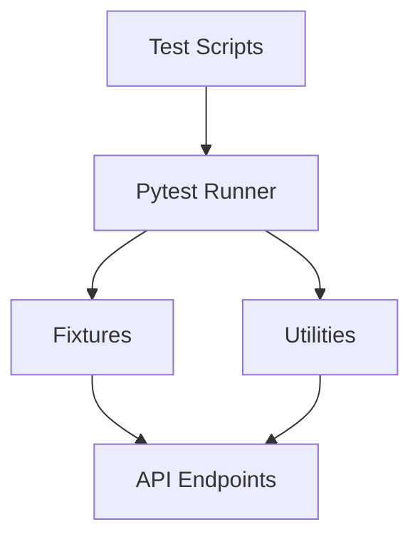

# Automation with Python and Pytest
A robust automation framework built with Python and Pytest for API and UI testing.

## 🎯 What This Project Demonstrates
- Designing scalable automation frameworks
- REST API testing using `requests` and Pytest
- Data-driven testing methodologies
- Modular fixture design and test utilities
- Integration with CI/CD pipelines
- Clear reporting and assertion strategies

## 📦 Framework Components
### 1. API Testing
- Endpoint validation
- Status code and payload assertions
- Authentication handling
### 2. Utilities & Helpers
- JSON schema validation
- Dynamic test data generation
### 3. Test Configuration
- Environment-specific settings
- Reusable Pytest fixtures

## 📸 Architecture Diagram (Mermaid)

